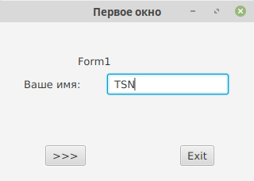
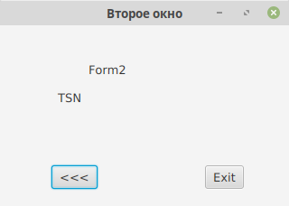
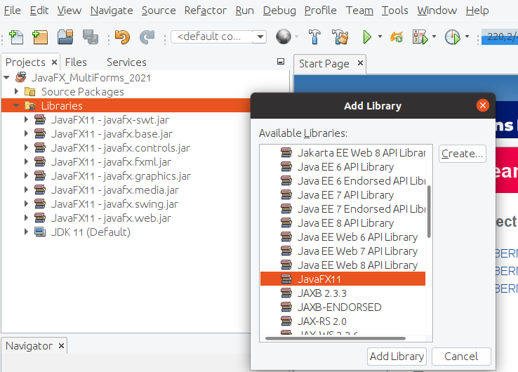
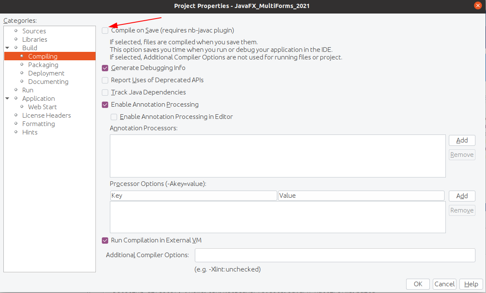
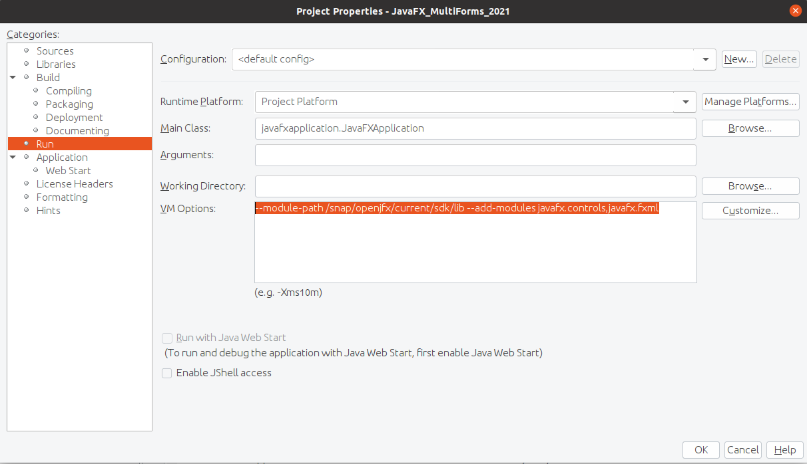

# JavaFX_MultiForms_2021
Простейшая многооконная программа на JavaFX (OpenJDK 11, linux)












```
--module-path /snap/openjfx/current/sdk/lib --add-modules javafx.controls,javafx.fxml 
```
